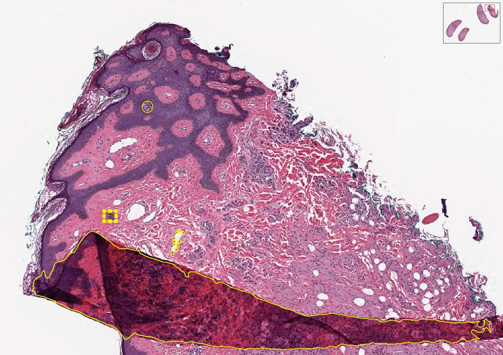

Annotations
-----------
Given an XML file of annotations, extract the data into the appropriate DICOM element.

If you have Annotations in the XML file structure listed below, and you want to include them in
your DICOM file, then all you need to do is to add the Annotations key and the associated
file path to the `General` attribute in the YAML file.

.. code-block:: xml

General:
    Annotations: '/path/to/xmlFile'

|Annotation|

Getting some sample XML data
++++++++++++++++++++++++++++
We have prepared some different annotations on the Aperio_ example CMU-1-JP2K-33005.svs.
These examples were drawn using QuPath_ and extracted with this_ script. The annotations
have no physiological relevance, only to show how the different data types can be
stored inside DICOM. Each of the yellow markups in the image above describe one of the following data types:

* Points
* Rectangle
* Area
* Ellipse

All of the data types should be encoded in an XML tree that looks like the following:

.. code-block:: xml

    <Annotations>
      <Annotation>
        <Regions>
          <Region Text="null" GeoShape="Points">
            ...
          </Region>
        </Regions>
      </Annotation>
    </Annotations>

The important characteristics here are `Text="null"` and  `GeoShape="Points"`. These define a human readable label(Text),
and a data type (GeoShape). Each will be discussed below.

Points
======
The simplest annotation type is the point. It defines as specific x and y coordinate (pixel). Each entry in this group
represents an independent data point. If there are points that have different meanings (e.g. mitosis vs lymphocyte),
then they should be grouped in a different section with a different `Text` value.

.. code-block:: xml

  <Region Id="1" Type="0" Text="null" GeoShape="Points" Zoom="0.042148" Selected="0" ImageLocation="" ImageFocus="0" Length="74565.8" Area="213363186.2" LengthMicrons="18798.0" AreaMicrons="13560170.4" NegativeROA="0" InputRegionId="0" Analyze="1" DisplayId="1">
    <Attributes/>
    <Vertices>
      <Vertex X="37279.312500" Y="4662.189453"/>
      <Vertex X="37319.550781" Y="4588.894043"/>
      <Vertex X="..." Y="..."/>
     </Vertices>
  </Region>

Rectangle
=========
The next simplest annotation is a rectangle, or bounding box. These annotations define an area that contains an object
of interest. They require four different points to describe the boundaries of the x and y corners.

.. code-block:: xml

  <Region Id="2" Type="2" Text="Necrosis" GeoShape="Rectangle" Zoom="0.042148" Selected="0" ImageLocation="" ImageFocus="0" Length="74565.8" Area="213363186.2" LengthMicrons="18798.0" AreaMicrons="13560170.4" NegativeROA="0" InputRegionId="0" Analyze="1" DisplayId="1">
    <Attributes/>
    <Vertices>
      <Vertex X="36406.388563" Y="4324.243648"/>
      <Vertex X="36554.076020" Y="4324.243648"/>
      <Vertex X="36554.076020" Y="4452.625555"/>
      <Vertex X="36406.388563" Y="4452.625555"/>
    </Vertices>
  </Region>

Area
====

An area annotations structured identically to the bounding box, except that there can be any number of x,y coordinate
pairs. This is the annotation typically used for image segmentation.

.. code-block:: xml

  <Region Id="3" Type="1" Text="Fold" GeoShape="Area" Zoom="0.042148" Selected="0" ImageLocation="" ImageFocus="0" Length="74565.8" Area="213363186.2" LengthMicrons="18798.0" AreaMicrons="13560170.4" NegativeROA="0" InputRegionId="0" Analyze="1" DisplayId="1">
    <Attributes/>
    <Vertices>
      <Vertex X="36382.175781" Y="4644.585938"/>
      <Vertex X="36389.238281" Y="4651.647949"/>
      ...
      <Vertex X="36262.121094" Y="4573.966309"/>
      <Vertex X="36255.058594" Y="4573.966309"/>
    </Vertices>
  </Region>

Ellipse
=======

Ellipses are just circular annotations. They have the same structure as Rectangles, but rather than being connected by
straight lines in an image viewer, they will instead be connected with curved lines.

.. code-block:: xml

  <Region Id="4" Type="0" Text="null" GeoShape="Ellipse" Zoom="0.042148" Selected="0" ImageLocation="" ImageFocus="0" Length="74565.8" Area="213363186.2" LengthMicrons="18798.0" AreaMicrons="13560170.4" NegativeROA="0" InputRegionId="0" Analyze="1" DisplayId="1">
    <Attributes/>
    <Vertices>
      <Vertex X="36943.806573" Y="2957.558623"/>
      <Vertex X="37011.368077" Y="3027.752393"/>
      <Vertex X="36943.806573" Y="3097.946164"/>
      <Vertex X="36876.245069" Y="3027.752393"/>
    </Vertices>
  </Region>

Inserting into the DICOM file
+++++++++++++++++++++++++++++

This process assumes you have a `pydicom`_ object called `ds`. Let's go ahead and build out the base for our annotations.

.. code-block:: python

    from pydicom.sequence import Sequence
    from pydicom.dataset import Dataset

    ds = ... # Stuff to create DICOM file
    dsDisplayedArea = Dataset()
    dsDisplayedArea.PresentationSizeMode = 'TRUE SIZE'
    ds.DisplayedAreaSelectionSequence = Sequence([dsDisplayedArea])
    ds.GraphicAnnotationSequence = Sequence([])
    ds.GraphicAnnotationSequence[0].ReferencedImageSequence = Sequence([])
    ds.GraphicAnnotationSequence[0].ReferencedImageSequence[0].GraphicObjectSequence = Sequence([])

Determine what type of annotation element is needed:

1. Rectangle

.. code-block:: python

    # Graphics on the first referenced image
    GraphicObjectSequence  = Dataset()
    GraphicObjectSequence.BoundingBoxTopLeftHandCorner = [36406.388563, 4452.625555]
    GraphicObjectSequence.BoundingBoxBottomRightHandCorner = [36554.076020, 4324.243648]  # bottom right coordinates of bounding box [max_x, min_y]
    GraphicObjectSequence.BoundingBoxAnnotationUnits = 'PIXEL'  # unit of coordinates
    GraphicObjectSequence.BoundingBoxHorizontalJustification = 'LEFT'
    GraphicObjectSequence.UnformattedTextValue = 'Necrosis'  # Text="Necrosis"
    GraphicObjectSequence.GraphicGroupID = '2'  # Id="2"
    gos = Sequence([GraphicObjectSequence])
    ds.GraphicAnnotationSequence[0].ReferencedImageSequence[0].GraphicObjectSequence.append(gos)
    del GraphicObjectSequence
    del gos

2. Points

.. code-block:: python

    GraphicObjectSequence  = Dataset()
    GraphicObjectSequence.GraphicType = "POINT"
    GraphicObjectSequence.NumberofGraphicPoints = 4  # how many points where saved in this domain, validate data is complete
    GraphicObjectSequence.GraphicData = [37279.312500, 4662.189453, 37319.550781, 4588.894043, ..., ...]   # x,y coordinates of points [x0, y0, x1, y1 ....]
    GraphicObjectSequence.GraphicAnnotationUnits = 'PIXEL'  # unit of coordinates
    GraphicObjectSequence.GraphicGroupID = '1'  # Id="1" Type="0" Text="null"
    gos = Sequence([GraphicObjectSequence ])
    ds.GraphicAnnotationSequence[0].ReferencedImageSequence[0].GraphicObjectSequence.append(gos)
    del GraphicObjectSequence
    del gos

3. Area

.. code-block:: python

    GraphicObjectSequence  = Dataset()
    GraphicObjectSequence.GraphicType = "POLYLINE"  # add polyline
    GraphicObjectSequence.NumberofGraphicPoints = 4 # how many points where saved in this domain
    GraphicObjectSequence.GraphicData = [36382.175781, 4644.585938, 36389.238281, 4651.647949, ..., ...]
    GraphicObjectSequence.GraphicAnnotationUnits = 'PIXEL'  # unit of coordinates
    GraphicObjectSequence.GraphicGroupID = 3  # Annotation Label ID: 2
    gos = Sequence([GraphicObjectSequence ])
    ds.GraphicAnnotationSequence[0].ReferencedImageSequence[0].GraphicObjectSequence.append(gos)
    del GraphicObjectSequence
    del gos

4. Ellipse

.. code-block:: python

    GraphicObjectSequence  = Dataset()
    GraphicObjectSequence.GraphicType = "ELLIPSE"
    GraphicObjectSequence.NumberofGraphicPoints = 4 # how many points where saved in this domain
    GraphicObjectSequence.GraphicData = [36943.806573, 2957.558623, 37011.368077, 3027.752393, 36943.806573, 3097.946164, 36876.245069, 3027.752393]
    GraphicObjectSequence.GraphicAnnotationUnits = 'PIXEL'  # unit of coordinates
    GraphicObjectSequence.GraphicGroupID = 3  # Annotation Label ID: 2
    gos = Sequence([GraphicObjectSequence ])
    ds.GraphicAnnotationSequence[0].ReferencedImageSequence[0].GraphicObjectSequence.append(gos)
    del GraphicObjectSequence
    del gos

.. _Aperio: http://openslide.cs.cmu.edu/download/openslide-testdata/Aperio/
.. _QuPath: https://qupath.github.io/
.. _this: https://github.com/smujiang/WSITools/blob/695eb8854dd8f246b808c76d663fdcb7418aeb3b/wsitools/wsi_annotation/QuPath_scripts/export_anno_tcga_xml.groovy
.. _pydicom: https://pydicom.github.io/pydicom/stable/
